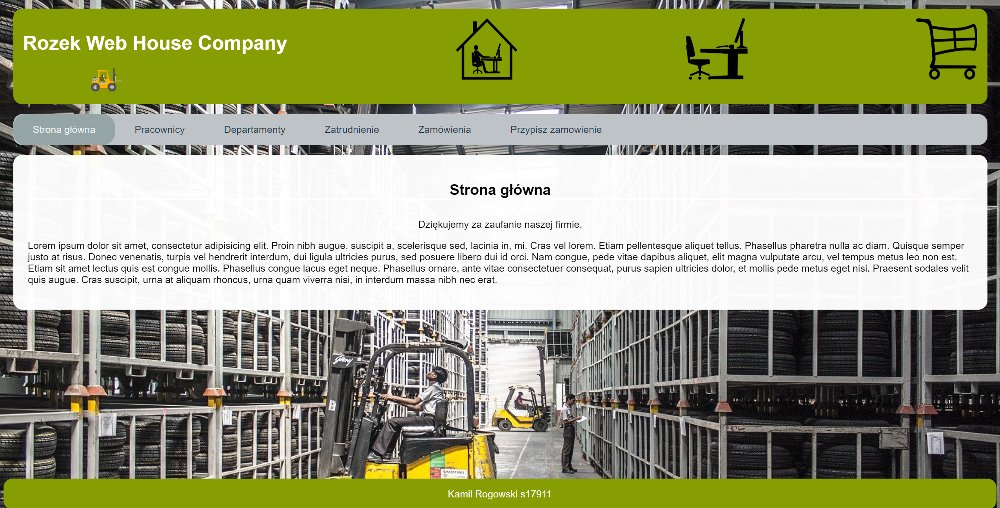
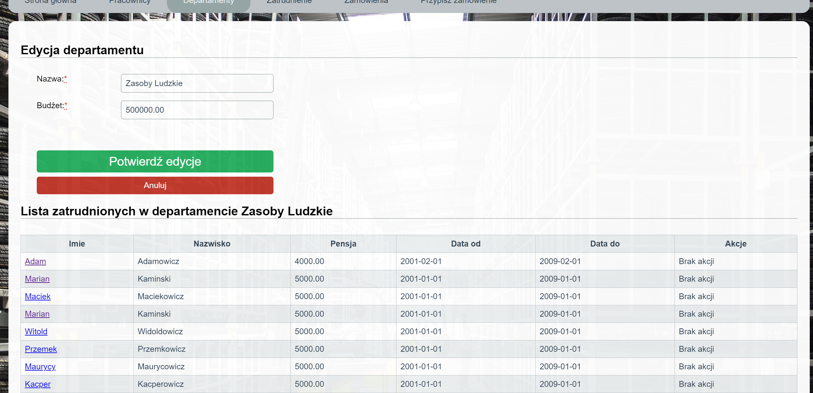
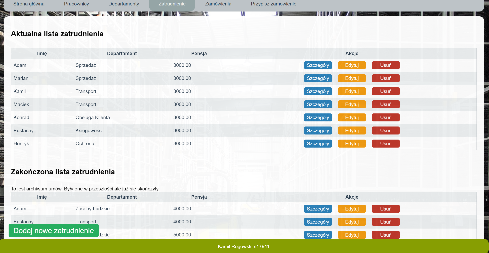

## TIN

Definicja projektu i diagram klas znajduje się w TIN_MP1

Pełna wersja strony znajduje się w tin_projekt_krogowski_s17911

## Wygląd strony

<!-- .element height=100px width=100px -->
<!-- .element height="50%" width="50%" -->
<!-- .element height="50%" width="50%" -->

## Uruchomienie
	1. Uruchomienie bazy
	
	Przejdź do katalogu backend 
	```
	$ cd ../tin_projekt_krogowski_s17911/backend
	```
	Uruchom kontener dockera
	```
	$ docker-compose up
	```
		Zamiast dockera możesz użyć po prostu bazy danych MySql na porcie 3306, jeżeli występują problemy sprawdź czy na pewno masz stworzony schemat bazy o nazwie tin-example-sequelize
	nazwa: root hasło: toor
		Możesz je zmienić w: 
	cd ../tin_projekt_krogowski_s17911/backend/config/sequelize

	2. Uruchomienie strony
	Przejdź do katalogu głównego projektu
	```
	$ cd ../tin_projekt_krogowski_s17911
	```
	Zainstaluj npm
	```
	$ npm install
	```
	Uruchom npm
	```
	$ npm start
	```

	Przejdź do strony 
	http://localhost:3000/


